# JanWhere

## Team Members

- **Mehran Wahid** - [Github](https://github.com/MehranSangrasi)
- **Abdullah Saim** - [Github](https://github.com/ASa1m)
- **Mahad Mohtashim** - [Github](https://github.com/chairman-lmao)
- **Haider Ali Kayani** - [Github](https://github.com/haiderkayani)
- **Laiba Shafqat** - [Github](https://github.com/la1baa)

## Technological Overview:

MERN is a popular web development stack that consists of four main technologies: MongoDB, Express.js, React.js, and Node.js. Each of these technologies handles an aspect of web development and together they provide a powerful and efficient framework for building full-stack web applications. Below is a brief description of these components:  

1. MongoDB: MongoDB is a NoSQL database that stores data in a flexible format, similar to JSON files. It is known for its scalability, high performance, and ease of use. MongoDB allows developers to store and retrieve data in a structured manner using documents. 
1. Express.js: Express.js is a lightweight web application framework for Node.js. It provides a set of features and  tools that help in building web  applications  and  APIs.  Express.js  simplifies  the  process  of  handling  HTTP  requests,  routing,  middleware,  and  managing  application-level functionality. 
1. React.js:  React.js  is  a  JavaScript  library  for  building  user  interfaces.  It  allows developers  to  create  reusable  UI  components  and  efficiently  update  the  user interface based on changes in data. Because of this architecture, it makes it easy to manage and manipulate complex UI structures. 
1. Node.js: Node.js is a JavaScript runtime environment for the server-side execution. It provides an event-driven model that makes it efficient and scalable. Node.js enables building server-side logic, handling network requests, and interacting with databases.
2. Google Maps API: Google Maps API is a powerful interface that allows developers to integrate and access various features and functionalities of Google Maps in their applications.

Together,  the  MERN  stack  enables  developers  to  build  modern  and  dynamic  web applications using JavaScript throughout the entire development process. The use of a single  programming  language  for  both  the  client  and  server-side  makes  it  easier  to maintain and develop applications. 

## Our idea: 

From the snowy peaks of the Himalayas to the vast deserts of Thar, Pakistan boasts a remarkable array of indigenous animal species that inhabit its diverse landscapes. The snow leopard, an elusive and endangered predator, thrives in the mountainous  regions  of  the  Karakoram  and  Himalayas, adorned with its stunning spotted coat. Another iconic species is the markhor, a regal and endangered wild goat known for its spiraling horns, agile climbing abilities, and presence in the lofty Hindu Kush and Karakoram ranges. The Indus River dolphin, a critically endangered freshwater mammal, navigates the murky waters of the Indus River system, utilizing echolocation to locate prey. These are just a glimpse of the diverse range of indigenous animal species that contribute to the ecological tapestry of Pakistan, highlighting the importance of their conservation and protection. 

 

Our app, JANWHERE, is designed to harness the power of technology and community participation to raise awareness and conserve the indigenous animal species of Pakistan and aims to provide a recreational experience for users. The app provides users with an interactive  map  interface  where  they  can  locate  and  mark  the  presence  of  various indigenous animals across the country. Additionally, the app's picture posting feature adds a recreational element as well. Users can capture and share their wildlife encounters by uploading pictures of the indigenous animals they come across. This not only enables them to create a personal wildlife gallery but also allows them to share their experiences with others, sparking conversations and fostering a sense of community among like- minded individuals. Below is an extensive list of the features provided in the application: 

1. **User Authentication and Profiles:** The app allows users to create accounts and authenticate themselves. User authentication is implemented using technologies such as token generators for secure password storage and session management. Once logged in, users can create and manage their posts, track their contributions, and interact with other users. 
1. **Map Interface with Google Maps API:** The app utilizes the Google Maps API to display an interactive map interface. Users can navigate, zoom in and out, and explore different regions of Pakistan. The Google Maps API provides various features and functionalities, such as custom markers, overlays, and event handling, enhancing the user experience and allowing seamless integration with other app features. 
1. **Indigenous Animal Markers:** The app uses markers on the map to pinpoint the locations of indigenous animal species. Each marker represents a specific animal species and contains relevant information such as the species name and habitat. 
1. **Picture Posting and Image Storage:** Users can capture pictures of indigenous animals they encounter and post them on the respective markers. The app handles the image upload process, which involves storing the images in a secure and scalable manner.  
1. **Data Management with MongoDB:** The MongoDB database is utilized to store and manage the app's data, including information about indigenous animal species, user profiles, markers, and associated images. MongoDB's flexibility and scalability make it suitable for handling complex and evolving data structures, ensuring efficient data management for the app. 
1. **Discover Page:** The app provides comprehensive information about each indigenous animal species. This data is fetched from the MongoDB database and displayed in a user-friendly manner. Users can access details and pictures taken by other users. Filters can be applied to improve searchability. 
1. **New Post Creation:** The app provides a dedicated page where users can create a new post by uploading images of indigenous animals they have encountered. As users upload images for their post, the app generates a preview section where the uploaded images are displayed in a gallery-like format. To provide context 

and improve searchability, the page includes an option for users to add animal name tag related to the indigenous animal species featured in their post.** 

## GUI :  

*HomePage – Desktop – Without Login* 

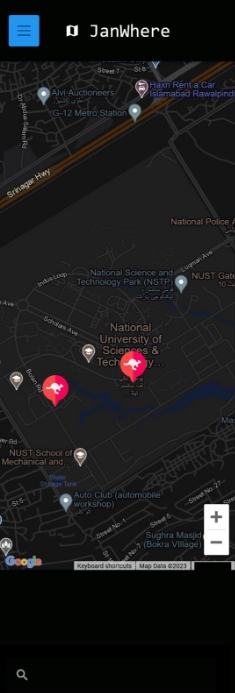 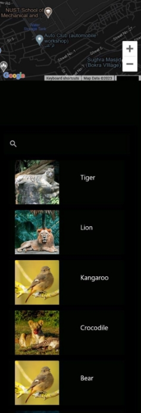 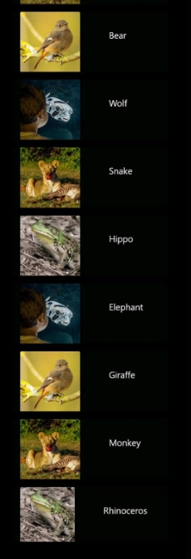

*HomePage – Mobile* 

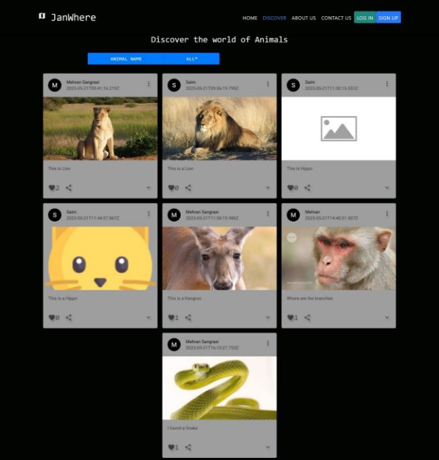

*Discover – Desktop* 

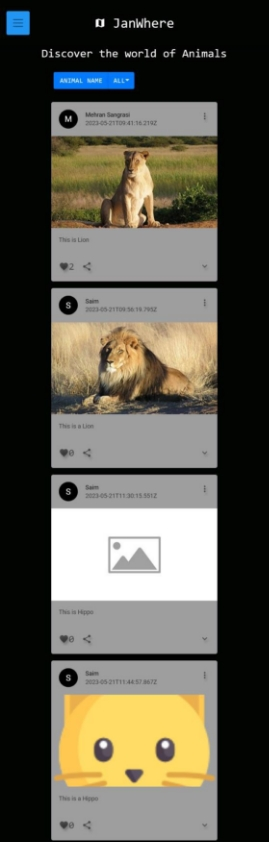 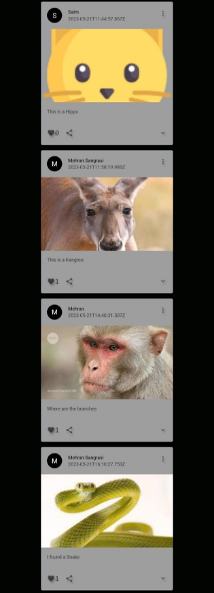

*Discover – Mobile* 

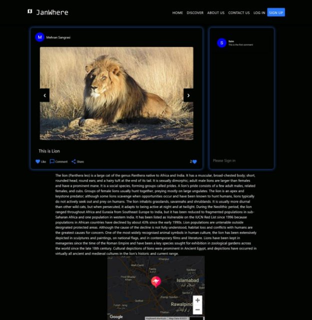

*Post – Desktop* 

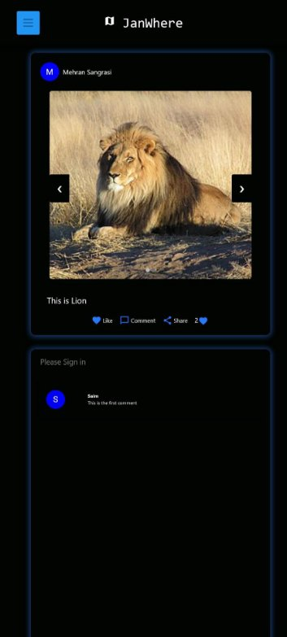 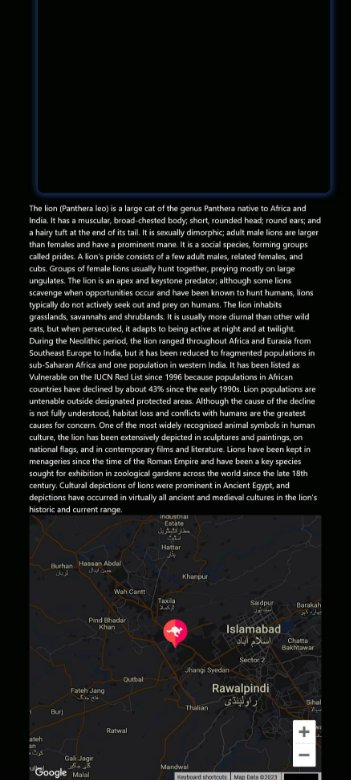

*Post – Mobile* 

*About Us – Desktop* 

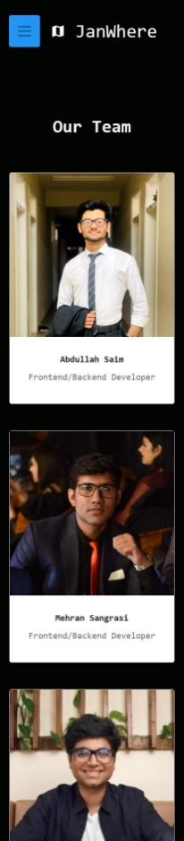 

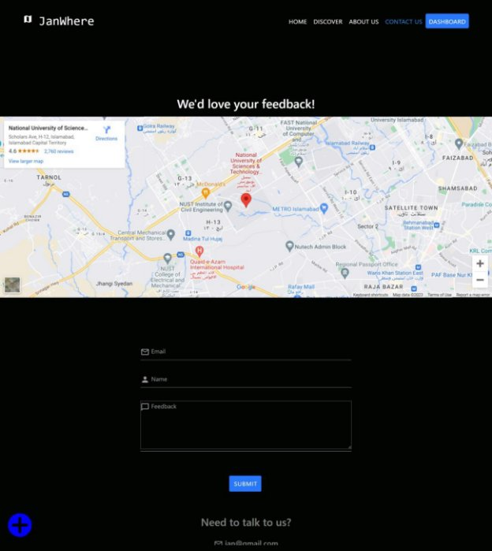

*Concat Us* 

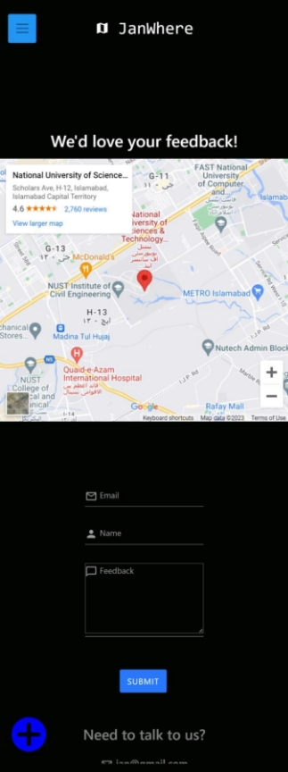

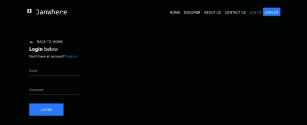

*Login* 

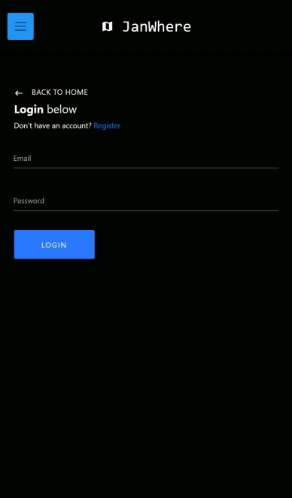

*Login – Mobile* 

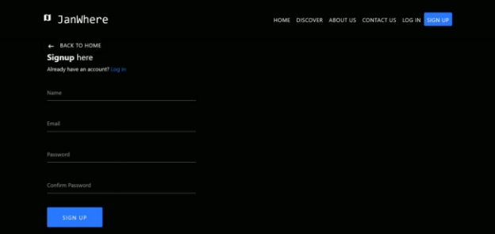

*SignUp – Desktop* 

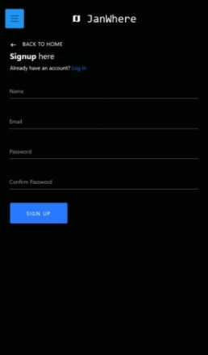

*SignUp - Mobile* 

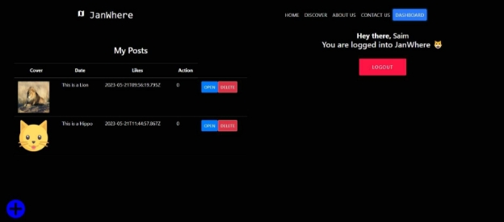

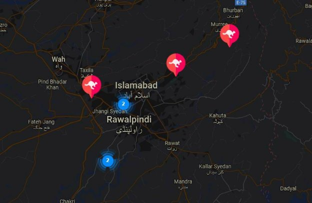

Map – Post Markers and Clusters 

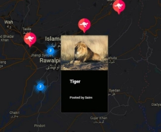

*Map  – Info box on Mouse Hover* 

*Map – Search Animals* 

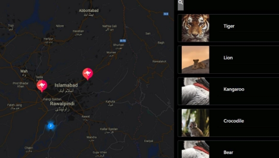

*Map – Filter posts based on animals* 

*Navbar – Mobile – Responsive* 

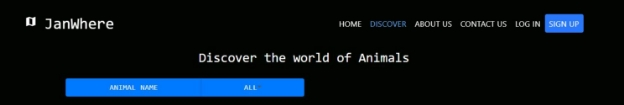

*Navbar – Active Link* 

*Navbar – Without Authentication *

*Navbar – With Authentication *

 

*Sticky Button – After Login* 

*Post – Keep Track of Likes* 

 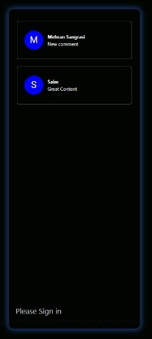

*Comments Available – Authentic User* 

*Post  – Copies Link on Share button* 

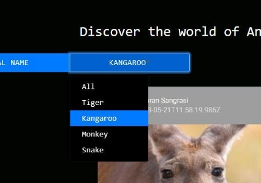

*Navbar – Without Authentication* 

Database: 

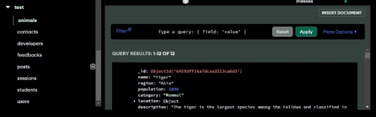

*MongoDB – Atlas (Remote Database)* 

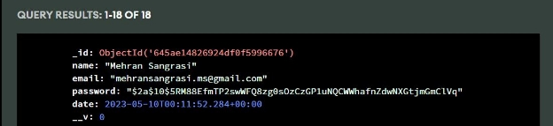

*User – Password Encrypted Hashing* 

Code: 

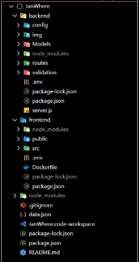 

*Code  – Important Configuration* 

## Configuration: 

**Available Scripts** 

In the project directory, you can run: 

**Start Frontend Server** 

- Get inside the frontend folder
- Run npm install to install required packages 

Open React App URL on[ http://localhost:3000/ ](http://localhost:3000/)to view it in the browser. 

**Start Backend Server** 

- Get inside the backend folder
- Run npm install to install required packages 

**Open API URL on[ http://localhost:5000/ ](http://localhost:5000/)to view it in the browser.** npm run dev

Launch both server and client simultaneously 

- First install concurrently globally in Node.js using npm install concurrently -g
- Set node options to use openssl-legacy mode using $env:NODE\_OPTIONS="--openssl-legacy-provider"
- Now run the command npm run dev
